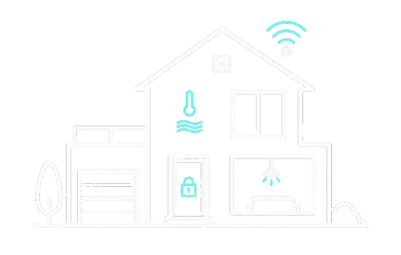

<p align="center">
  
  <br><strong style="font-size:1.5rem;">Domotic Home</strong>
</p>

<p align="center">
  
  
  
</p>

Firmware para ATmega2560 de un sistema domótico académico con control de seguridad, accesos RFID, confort ambiental y servicios remotos. Escrito en C puro; el RFID usa la librería externa [MFRC522](https://github.com/miguelbalboa/rfid) (adaptador en `src/rfid_rc522/rfid_rc522_lib.cpp`). El resto son drivers propios.

## Hardware

| Componente | Función |
|---|---|
| ATmega2560 / Arduino Mega 2560 | Controlador principal |
| RC522 | Lectura de tarjetas RFID |
| LCD 16x2 | Interfaz de usuario local |
| Teclado matricial 4x4 | Navegación y entrada de datos |
| 2x PIR HC-SR501 | Detección de intrusión |
| MQ-2 | Detección de humo/incendio |
| Servomotor | Apertura de garaje |
| Potenciómetro | Control de iluminación (ADC) |
| LEDs, relé | Actuadores simulados donde no hay hardware físico |

El detalle de pines está en [`docs/02_HARDWARE_Y_PINOUT.md`](docs/02_HARDWARE_Y_PINOUT.md), [`docs/06_MAPEO_PINES_ATMEGA2560.md`](docs/06_MAPEO_PINES_ATMEGA2560.md) y [`src/common/Definiciones.h`](src/common/Definiciones.h).

## Funcionalidad

### Seguridad

- Alarma de acceso: se activa/desactiva por código. Dispara con sensores PIR o pulsador de prueba (D45).
- Alarma de incendio: se activa/desactiva por código. Dispara con MQ-2 por ADC o pulsador de prueba (D44).
- Eventos críticos reportados por UART0.

### Accesos RFID

- Lectura de tarjetas por RC522 sobre SPI.
- Enrolamiento y borrado de usuarios desde menú LCD/teclado.
- Roles: padre (administrador) e hijo (cupos limitados).
- Puerta principal: LED como imán.
- Garaje: servomotor.
- Habitación de juegos: validación RFID + cupos en EEPROM.
- Recarga de cupos por usuario padre.

### Confort

- Iluminación dimerizada: LED con PWM (D7), nivel definido por potenciómetro.
- Temperatura: control simulado de calefactor y ventilador.
- Sonido remoto: ON/OFF y volumen por UART1; estado lógico en LCD y eventos por UART0 (sin salida PWM física).

### Servicios remotos (UART1)

- Horno: encendido con temperatura y tiempo configurable, apagado automático.
- Sonido: encendido/apagado y volumen.
- Mercado: lista de productos con cantidad, consultable remotamente.
- Comandos documentados en [`docs/07_COMANDOS_USART.md`](docs/07_COMANDOS_USART.md).

```
HELP
RADIO ON
RADIO VOL 70
HORNO ON 180 2
MERCADO LIST
```

## Arquitectura

Tareas cooperativas no bloqueantes en `loop()`. Ningún módulo bloquea al resto: el sistema lee sensores, actualiza LCD, atiende comandos remotos y maneja actuadores en cada ciclo.

```c
void setup(void) {
    UART_Init(UART_BAUD_DEFAULT);
    GPIO_Init();
    ADC_Init();
    PWM_Init();
    ServoPwm_Init();
    Timer_Init();
    EEPROM_Init();
    RFID_Init();
    Seguridad_Init();
    Accesos_Init();
    Confort_Init();
    Remoto_Init();
    UI_Init();
}

void loop(void) {
    uint32_t now_ms = Timer_Millis();

    UART_Task();
    UART1_Task();
    UART_Bridge_Task();

    RFID_Task(now_ms);
    Seguridad_Task(now_ms);
    Accesos_Task(now_ms);
    Confort_Task(now_ms);
    Remoto_Task(now_ms);
    UI_Task(now_ms);

    UART_Task();
    UART1_Task();
}
```

`UART0` se usa para debug y eventos del sistema. `UART1` para control remoto. Un bridge reenvía lo tecleado en el Monitor Serie (UART0) al parser de comandos, y las respuestas de UART1 se replican en ambos canales.

## Estructura del repositorio

```
domotic-home.ino          Orquestador: setup + loop
```

**Drivers**

| Módulo | Archivos |
|---|---|
| common | [`Definiciones.h`](src/common/Definiciones.h) |
| gpio | [`gpio.h`](src/gpio/gpio.h), [`gpio.c`](src/gpio/gpio.c) |
| timer | [`timer.h`](src/timer/timer.h), [`timer.c`](src/timer/timer.c) |
| uart | [`uart.h`](src/uart/uart.h), [`uart.c`](src/uart/uart.c) |
| spi | [`spi.h`](src/spi/spi.h), [`spi.c`](src/spi/spi.c) |
| adc | [`adc.h`](src/adc/adc.h), [`adc.c`](src/adc/adc.c) |
| pwm | [`pwm.h`](src/pwm/pwm.h), [`pwm.c`](src/pwm/pwm.c) |
| servo | [`servo_pwm.h`](src/servo/servo_pwm.h), [`servo_pwm.c`](src/servo/servo_pwm.c) |
| eeprom | [`eeprom.h`](src/eeprom/eeprom.h), [`eeprom.c`](src/eeprom/eeprom.c) |
| rfid_rc522 | [`rfid_rc522.h`](src/rfid_rc522/rfid_rc522.h), [`rfid_rc522.c`](src/rfid_rc522/rfid_rc522.c), [`rfid_rc522_lib.cpp`](src/rfid_rc522/rfid_rc522_lib.cpp) |
| keypad | [`keypad.h`](src/keypad/keypad.h), [`keypad.c`](src/keypad/keypad.c) |

**Módulos de aplicación**

| Módulo | Archivos |
|---|---|
| seguridad | [`Seguridad.h`](src/seguridad/Seguridad.h), [`Seguridad.c`](src/seguridad/Seguridad.c) |
| accesos | [`Accesos.h`](src/accesos/Accesos.h), [`Accesos.c`](src/accesos/Accesos.c) |
| confort | [`Confort.h`](src/confort/Confort.h), [`Confort.c`](src/confort/Confort.c) |
| remoto | [`Remoto.h`](src/remoto/Remoto.h), [`Remoto.c`](src/remoto/Remoto.c) |
| ui | [`UI.h`](src/ui/UI.h), [`UI.c`](src/ui/UI.c), [`lcd.h`](src/ui/lcd.h), [`lcd.c`](src/ui/lcd.c) |
| test | [`test_bootstrap.h`](src/test/test_bootstrap.h), [`test_bootstrap.c`](src/test/test_bootstrap.c) |

**Documentación**

| Documento |
|---|
| [`00_ALCANCE_Y_DEMO.md`](docs/00_ALCANCE_Y_DEMO.md) |
| [`01_ARQUITECTURA.md`](docs/01_ARQUITECTURA.md) |
| [`02_HARDWARE_Y_PINOUT.md`](docs/02_HARDWARE_Y_PINOUT.md) |
| [`03_INTERFAZ_LCD_TECLADO.md`](docs/03_INTERFAZ_LCD_TECLADO.md) |
| [`04_EEPROM.md`](docs/04_EEPROM.md) |
| [`05_PLAN_IMPLEMENTACION.md`](docs/05_PLAN_IMPLEMENTACION.md) |
| [`06_MAPEO_PINES_ATMEGA2560.md`](docs/06_MAPEO_PINES_ATMEGA2560.md) |
| [`06_UART_EVENTOS.md`](docs/06_UART_EVENTOS.md) |
| [`07_COMANDOS_USART.md`](docs/07_COMANDOS_USART.md) |

## Notas sobre simulaciones

Varios actuadores del enunciado se representan con LEDs o relé porque el propósito del proyecto es demostrar integración de sensores, lógica de control, persistencia y comunicación serial, no construir una casa domótica funcional. Cada simulación está declarada explícitamente.
